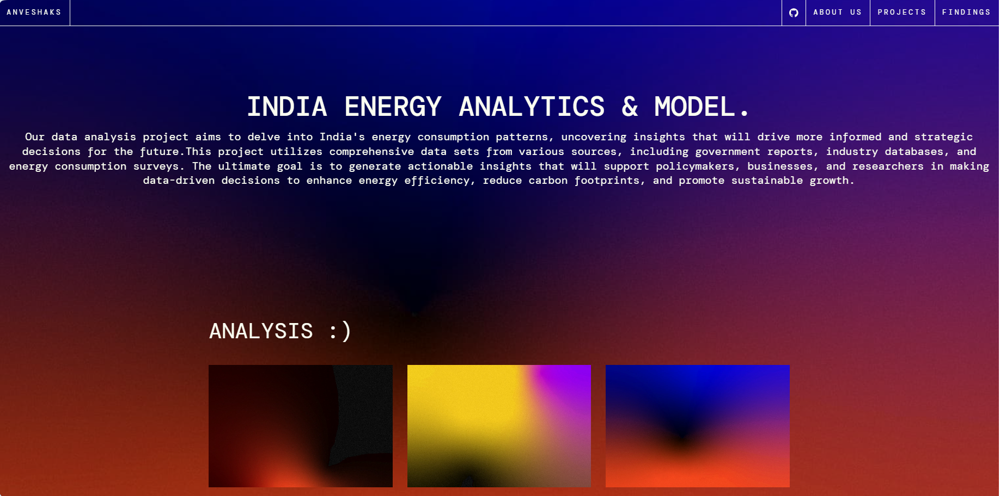
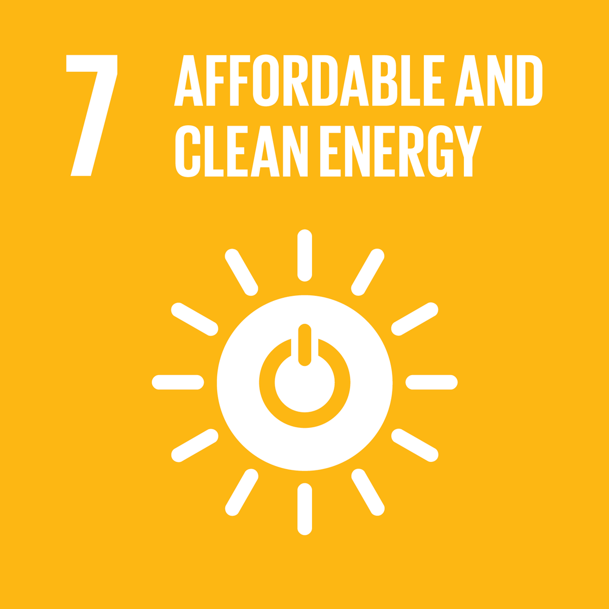
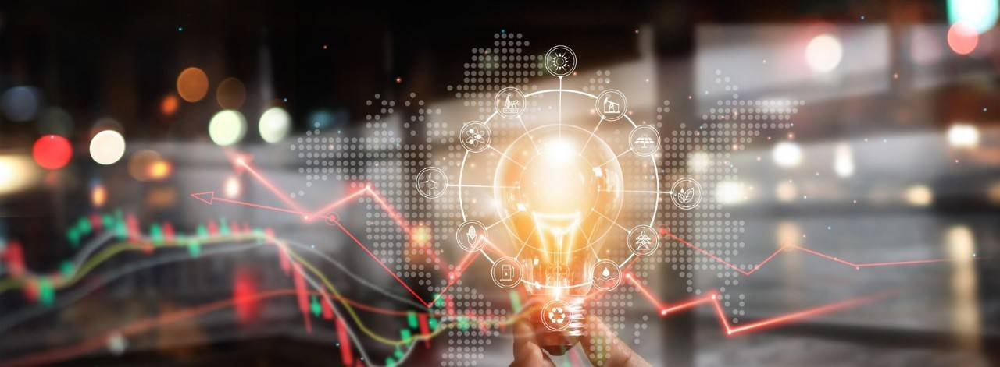

# India energy analytics and model ⚡️⚡️⚡️

## ⚡️ SDG 7

With a focus on energy equity, security, and affordability, this project aims to support India's sustainable energy development while also effectively advancing SDG 7, which calls for universal access to modern, affordable, sustainable, and reliable energy.

## 🔎 Problem Identification: 

India faces the challenge of meeting growing energy demands while reducing its carbon footprint. Despite progress in renewable energy adoption, non-renewable sources still dominate the energy mix, leading to significant greenhouse gas emissions and environmental impacts.

 With a focus on the importance of renewable energy sources, this project will offer a thorough examination of India's developments in energy production. Comprehending these patterns will aid in devising tactics to augment the proportion of sustainable energy, consequently endorsing equitable energy use, economical savings, and sustainable development.

## 📒📚 Data Collection and Analysis:
 📋  The project has utilized data from:

Ministry of Power, Government of India
Central Electricity Authority (CEA)
International Energy Agency (IEA)
World Bank
Renewable Energy Reports from various research institutions
Key Metrics and Features

🔑 The Key features of the data set will include :

⚡️⚡️⚡️⚡️⚡️⚡️⚡️⚡️⚡️⚡️⚡️⚡️⚡️⚡️⚡️⚡️⚡️⚡️⚡️⚡️⚡️⚡️⚡️

🟩 Total Energy Production: 
Data on the total energy produced annually.

🟨 Energy Source Breakdown: 
Percentage of energy produced from renewable (solar, wind, hydro, biomass) and non-renewable (coal, natural gas, oil) sources.

🟩 Renewable Energy Types: 
Detailed data on the contributions of different renewable sources.

🟨 Greenhouse Gas Emissions: 
Associated emissions data

🟩 Economic Metrics: 
Energy costs, investment data, and pricing trends.

## ⚒️ ⚙️ Tools for analysis:-
The following tools are used for data analysis:

🐍 Python: For data processing, analysis, and visualization (matplotlib, numpy, pandas, aur scikit learn).

📊 Excel: For data aggregation and preliminary analysis.

🏙️ Hypothesis Development: 

In order to increase energy security and availability in India, the initiative postulated that a larger proportion of renewable energy sources would dramatically cut greenhouse gas emissions and energy costs. Furthermore, it asserts that a move to renewable energy sources would eventually result in more stable and possibly even cheaper energy costs.

## 🧪 Solution Design: 
🔧The methodology will include the following steps:

🟦 Data Collection:

Gather data on energy production, source types, costs, and emissions.

⬛️ Data Cleaning and Preprocessing:

Handle missing values, outliers, and inconsistencies in the data.

Standardize data formats and integrate datasets from different sources.

🟦 Ensure data quality and consistency.

Descriptive Analysis:
Perform descriptive statistical analysis to understand the distribution and variability of pollutants.
Visualize temporal trends (daily, monthly, seasonal) and spatial distributions using charts and maps

## 📂 🔎 Source Analysis 

📎 Analyze the overall trends in energy production and the share of renewable and non-renewable sources.

Break down renewable energy into types and analyze their contributions.

Predictive Modeling:

Develop models to forecast greenhouse gas emissions, future energy trends, and energy costs.

Solution Development:

Propose strategies for increasing renewable energy adoption.

Reporting and Presentation:

Compile findings and recommendations into a comprehensive report.

## 📊 ✨Visualization: 
Comprehensive Analysis: Detailed insights into India's energy production trends and the role of renewables.

🟨 Predictive Models: 
Forecasts of future energy trends, and energy costs.

🟧 Actionable Recommendations: 
Strategies for increasing renewable energy adoption.

🟨 Impact Assessment:
Evaluation of potential benefits in terms of cost, security, and access.

✨✨✨✨✨✨✨✨✨✨✨✨✨✨✨✨✨✨✨✨✨✨✨✨

